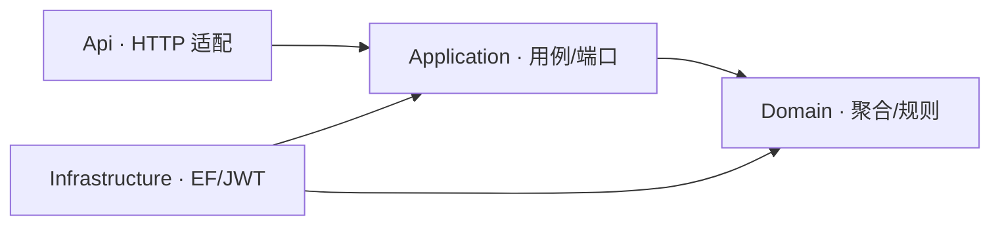

# MyBaseSystem

一套面向长期复用的基础前后端系统。前端基于 [tabtab-dev/ui](https://github.com/tabtab-dev/ui) 的 Vue 3 Monorepo；后端采用 .NET 10、DDD 与 Clean Architecture。目标是让新业务以模块方式接入，而不是反复开发登录、权限、用户和系统管理。

## 当前完成度

首版已经打通真实闭环：登录、JWT Access/Refresh Token、刷新令牌轮换与撤销、会话恢复、用户 CRUD、角色 CRUD、权限查询、按权限获取菜单、操作审计、登录日志、健康检查、Swagger、SQLite 初始化和管理员种子数据。

领域模型已预置部门、字典、系统参数、菜单、登录日志等基础实体；这些模块的完整管理界面和用例将在后续迭代补齐，不把预置模型当作已完成功能。

默认管理员：`admin` / `Admin123!`。首次登录后应立即修改密码。生产环境必须通过 `Jwt__Key` 配置不少于 32 字节的随机密钥。

## 架构

后端依赖方向始终指向内层：



- `MyBaseSystem.Domain`：实体、聚合规则、值对象和领域事件；不依赖 EF Core 或 ASP.NET Core。
- `MyBaseSystem.Application`：应用用例、DTO、仓储端口、服务端口；不依赖 Infrastructure。
- `MyBaseSystem.Infrastructure`：EF Core、SQLite、仓储实现、JWT、密码散列和种子数据。
- `MyBaseSystem.Api`：控制器、中间件、认证授权和 OpenAPI；控制器只调用 Application 用例。
- `MyBaseSystem.Tests`：领域规则和后续应用/集成测试。

前端保留 TabTab UI 的五种布局、主题、国际化、标签页、全局搜索、组件库与 pnpm workspace 结构。全部前端代码位于 `frontend/`，其中业务应用位于 `frontend/apps/admin`，通用组件位于 `frontend/packages/ui`；全部 .NET 代码、解决方案和测试位于 `backend/`。

## API 规范

- 前缀：`/api/v1`
- 成功响应：`{ "success": true, "data": ..., "message": "ok" }`
- 失败响应：`{ "success": false, "data": null, "code": "ERROR_CODE", "message": "...", "traceId": "..." }`
- 分页：`page` 从 1 开始，`pageSize` 最大 100；响应数据为 `{ items, total, page, pageSize }`
- 身份：`Authorization: Bearer <accessToken>`；刷新令牌只用于 `/auth/refresh` 和 `/auth/logout`
- 权限码：`领域:资源:动作`，例如 `system:user:update`

| 方法 | 地址 | 说明 |
|---|---|---|
| POST | `/api/v1/auth/login` | 登录 |
| POST | `/api/v1/auth/refresh` | 轮换刷新令牌 |
| POST | `/api/v1/auth/logout` | 撤销刷新令牌 |
| GET | `/api/v1/auth/me` | 当前用户及权限 |
| GET/POST | `/api/v1/users` | 用户查询/创建 |
| PUT/DELETE | `/api/v1/users/{id}` | 用户修改/软删除 |
| GET/POST | `/api/v1/roles` | 角色查询/创建 |
| PUT/DELETE | `/api/v1/roles/{id}` | 角色修改/软删除 |
| GET | `/api/v1/permissions` | 权限清单 |
| GET | `/api/v1/menus` | 当前用户菜单树 |
| GET | `/api/v1/audit-logs` | 操作审计日志 |
| GET | `/health` | 服务与数据库健康检查 |

启动后访问 `http://localhost:5080/swagger` 查看完整契约。

## 本地开发

要求：.NET SDK 10、Node.js 20+、pnpm 10.32.1。

```bash
# 后端
dotnet run --project backend/src/MyBaseSystem.Api --urls http://localhost:5080

# 前端（另一个终端）
corepack enable
cd frontend
pnpm install --frozen-lockfile
pnpm dev:admin
```

前端地址为 `http://localhost:3001`，开发代理会把 `/api` 转发到 `http://localhost:5080`。SQLite 文件首次启动自动创建于 `data/my-base-system.db`。

完整构建：

```bash
dotnet restore backend/MyBaseSystem.slnx
dotnet build backend/MyBaseSystem.slnx -c Release
dotnet test backend/MyBaseSystem.slnx -c Release
pnpm --dir frontend build
```

Docker 启动：

```bash
cp .env.example .env
# 修改 .env 中的密钥
docker compose up --build
```

## 复用规则

新业务模块优先按一个限界上下文组织，并遵守：领域层表达业务不变量；应用层编排用例；基础设施层实现端口；API 层只做 HTTP 映射。禁止控制器直接访问 `AppDbContext`，禁止领域层引用 EF Core，跨模块通信优先使用应用端口或领域事件。

数据库默认 SQLite 只为开箱即用。切换 PostgreSQL、MySQL 或 SQL Server 时，在 Infrastructure 新增 provider 和迁移程序集，不应修改 Domain/Application。

## 来源与许可

前端基于 `tabtab-dev/ui` 演进，保留其组件化与 Monorepo 设计。发布或再分发前请同步核对上游仓库的最新许可声明和第三方依赖许可。
